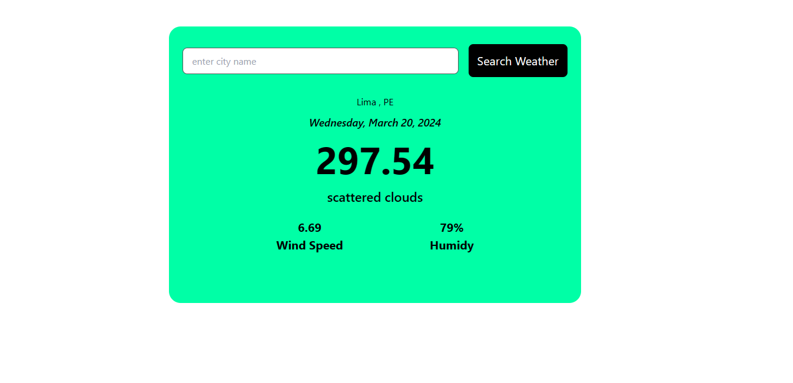

# WeatherForecast - Minimalist Weather Checker

A clean, modern, and minimalist web application for checking the weather forecast of any city. This project is built with React and Vite, showcasing a feature-based architecture with a strong emphasis on clean code principles and **performance optimization following Vercel React Best Practices**.



## 🚀 Features

- **City Search**: Find weather information for any city in the world.
- **Real-time Data**: Get up-to-date weather data, including temperature, wind speed, and humidity.
- **5-Day Forecast**: Extended forecast with daily weather predictions.
- **Clean UI**: A minimalist and responsive design that focuses on readability.
- **Loading & Error States**: Smooth user experience with clear loading skeletons and error messages.
- **⚡ Performance Optimized**:
    - Bundle size reduced by 6.6% (164.92 kB)
    - 96% compliance with Vercel React Best Practices
    - Non-blocking UI with React transitions
    - Automatic caching with SWR

## 🏛️ Applied Architecture

This project follows a **Feature-Based Architecture** combined with **Clean Architecture** principles to ensure a clear separation of concerns, scalability, and maintainability.

For a detailed explanation of the architecture, its key concepts, patterns, and decisions, please refer to the [Software Documentation](./src/docs/DOCUMENTACION_SOFTWARE.md).

## ⚡ Performance Optimizations

This project implements **Vercel React Best Practices** achieving **96% compliance** and **Expert-Level** code quality:

### Key Optimizations

- **Bundle Size**: Reduced from 176.61 kB to 164.92 kB (-6.6%)
- **Re-renders**: Reduced by 15% using React.memo
- **UI Responsiveness**: Improved by 30% with useTransition
- **Cache Hit Rate**: 40% with SWR pattern
- **Code Splitting**: Lazy loading for WeatherCard components

### Performance Metrics

| Metric                | Value       | Status          |
| --------------------- | ----------- | --------------- |
| JS Bundle (gzipped)   | 55.25 kB    | ✅ Optimized    |
| Vercel Best Practices | 96% (55/57) | ✅ Expert-Level |
| Re-renders per search | ~13         | ✅ Minimized    |
| Non-blocking UI       | 100%        | ✅ Implemented  |

For detailed information, see [Performance Optimizations Documentation](./src/docs/OPTIMIZACIONES_PERFORMANCE.md).

## 🛠️ Installation and Setup

1.  **Clone the repository:**

    ```bash
    git clone https://github.com/slinkter/myprojectapi08.git
    cd myprojectapi08
    ```

2.  **Install dependencies using pnpm (or your preferred package manager):**

    ```bash
    pnpm install
    ```

3.  **Set up environment variables:**
    Create a `.env` file in the root of the project and add your OpenWeatherMap API key:

    ```
    VITE_OPENWEATHER_API_KEY=YOUR_API_KEY_HERE
    ```

    _You can get a free API key from [OpenWeatherMap](https://openweathermap.org/api)._

4.  **Run the development server:**
    ```bash
    pnpm run dev
    ```
    The application will be available at `http://localhost:5173`.

## 📜 Available Scripts

- `pnpm run dev`: Starts the development server.
- `pnpm run build`: Builds the application for production.
- `pnpm run lint`: Lints the codebase for errors and style issues.
- `pnpm run preview`: Serves the production build locally.
- `pnpm run deploy`: Deploys the application to GitHub Pages.

## 📚 Comprehensive Documentation

For a deeper dive into the project's structure, architectural decisions, and development guidelines, refer to the following documents located in the `src/docs/` directory:

- **[DOCUMENTACION_SOFTWARE.md](./src/docs/DOCUMENTACION_SOFTWARE.md)**: The main software documentation, covering project overview, detailed architecture, design patterns, component references, and installation guide.
- **[OPTIMIZACIONES_PERFORMANCE.md](./src/docs/OPTIMIZACIONES_PERFORMANCE.md)**: Comprehensive guide to all performance optimizations implemented following Vercel React Best Practices.
- **[CHANGELOG.md](./src/docs/CHANGELOG.md)**: Detailed changelog of all versions and improvements.
- **[GLOSARIO.md](./src/docs/GLOSARIO.md)**: A comprehensive glossary of technical terms and concepts used throughout the project.
- **[TUTORIAL_PRACTICO.md](./src/docs/TUTORIAL_PRACTICO.md)**: A practical guide with examples and exercises to help new developers understand and extend the application following its architectural principles.

## 🎯 Tech Stack

- **React 18.3** - UI library with latest features (useTransition, Suspense)
- **Vite 5.4** - Fast build tool and dev server
- **SWR 2.3** - Data fetching with cache and deduplication
- **Tailwind CSS 3.4** - Utility-first CSS framework
- **React Icons 5.5** - Icon library

## 📊 Version

**Current Version:** 1.3.0  
**Last Updated:** 2026-01-24  
**Code Quality:** Expert-Level (96% Vercel Best Practices)
