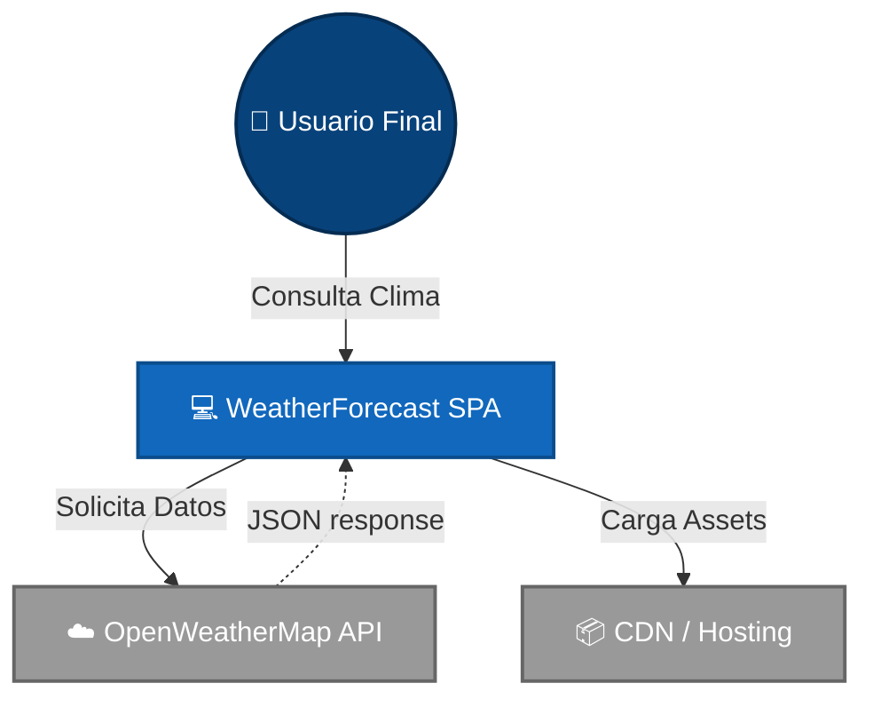
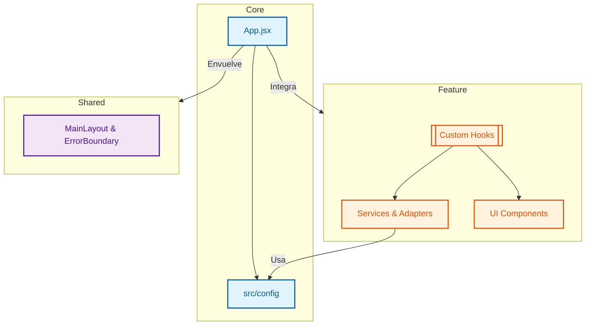
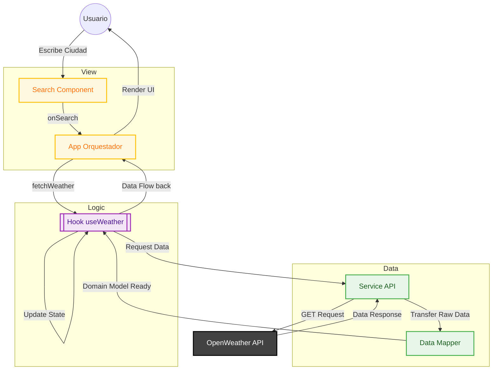
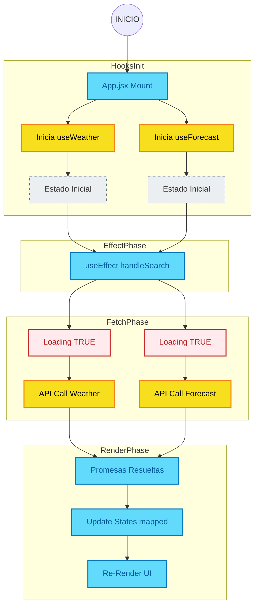

# Documentación de Software: WeatherForecast App

**Versión**: 1.2.0
**Fecha**: 2026-01-22
**Estado**: Estable / Producción

---

## Tabla de Contenidos

1.  [Visión del Producto](#1-visión-del-producto)
2.  [Requerimientos Funcionales](#2-requerimientos-funcionales)
3.  [Requerimientos No Funcionales](#3-requerimientos-no-funcionales)
4.  [Metodología SCRUM](#4-metodología-scrum)
5.  [Arquitectura del Sistema](#5-arquitectura-del-sistema)
6.  [Diseño del Sistema](#6-diseño-del-sistema)
7.  [Patrones y Antipatrones](#7-patrones-y-antipatrones)
8.  [Decisiones Técnicas (ADR)](#8-decisiones-técnicas-adr)
9.  [Costos y Esfuerzo](#9-costos-y-esfuerzo)
10. [Riesgos del Sistema](#10-riesgos-del-sistema)
11. [Roadmap Evolutivo](#11-roadmap-evolutivo)
12. [Glosario Técnico](#12-glosario-técnico)

---

## 1. Visión del Producto

**WeatherForecast App** es una plataforma web (SPA) diseñada para profesionales y usuarios generales que requieren acceso inmediato y visualmente limpio a información meteorológica global. A diferencia de portales clima saturados de publicidad, nuestra solución ofrece una experiencia "Zen", minimalista y de alto rendimiento, enfocada en la legibilidad y la precisión de los datos.

---

## 2. Requerimientos Funcionales

*   **RF-01 Consulta Meteorológica**: El sistema debe permitir consultar el clima actual de cualquier ciudad válida.
*   **RF-02 Pronóstico Extendido**: El sistema debe mostrar un resumen del pronóstico para los próximos 5 días, incluyendo temperaturas mínimas/máximas y condición general.
*   **RF-03 Visualización Detallada**: Debe mostrar temperatura, sensación térmica, humedad, velocidad del viento y hora local de la ciudad consultada.
*   **RF-04 Feedback de Estado**: Debe indicar visualmente al usuario cuando se están cargando datos o si ha ocurrido un error (ej. ciudad no encontrada).

---

## 3. Requerimientos No Funcionales

*   **RNF-01 Performance**: El **First Contentful Paint (FCP)** debe ser menor a 1.5s en conexiones 4G.
*   **RNF-02 Escalabilidad de Código**: La arquitectura debe permitir agregar nuevas features sin modificar el orquestador principal más allá de la integración.
*   **RNF-03 UX/UI**: La interfaz debe ser responsive (Mobile First) y respetar los principios de diseño minimalista (espaciado, tipografía Inter).
*   **RNF-04 Mantenibilidad**: Cero acoplamiento entre la capa de vista y la capa de servicios externos.

---

## 4. Metodología SCRUM

El desarrollo se gestiona bajo el marco SCRUM, adaptado para un equipo ágil de alto rendimiento.

### 4.1. Roles
*   **Product Owner (PO)**: Define la visión y prioriza el Backlog (Features como "Forecast 5 días").
*   **Scrum Master (SM)**: Facilita los eventos y elimina impedimentos (ej. bloqueos de API Key).
*   **Engineering Team**: Agentes multidisciplinarios (UX, Frontend, Architect) responsables del incremento.

### 4.2. Artefactos
*   **Product Backlog**: Lista priorizada de deseos del usuario.
*   **Sprint Backlog**: Tareas técnicas seleccionadas para el ciclo actual (Refactorización + Nuevos Hooks).
*   **Incremento**: Software funcional desplegable al final de cada Sprint (v1.1.0 -> v1.2.0).

### 4.3. Eventos
*   **Sprint Planning**: Definición del objetivo "Desacoplamiento y Features".
*   **Daily Standup**: Sincronización rápida de progreso y bloqueos.
*   **Sprint Review**: Demostración de `ForecastDisplay` funcionando.

---

## 5. Arquitectura del Sistema

El sistema sigue una variacion de **Clean Architecture** adaptada al frontend, denominada **Feature-Based Architecture**.

### 5.1. Diagrama de Contexto (C4 Nivel 1)

### 5.2. Arquitectura de Contenedores (Feature-Based)

---

## 6. Diseño del Sistema

### 6.1. Diagrama de Flujo de Datos

### 6.2. Ciclo de Vida y Ejecución (Lifecycle)
Detalle del primer renderizado y la ejecución paralela de hooks.

---

## 7. Patrones y Antipatrones

### 7.1. Patrones Aplicados
*   **Adapter Pattern (Mappers)**: `weatherMapper.js` y `forecastMapper.js` aíslan el dominio de la estructura de la API externa.
*   **Facade Pattern (Hooks)**: Los custom hooks (`useWeather`) proveen una fachada simplificada para gestionar la complejidad de lógica y estado.
*   **Separation of Concerns**: UI separada de Lógica, Lógica separada de Infraestructura (Servicios).

### 7.2. Antipatrones Evitados
*   **God Component**: Se refactorizó `App.jsx` para dejar de ser un componente masivo y pasar a ser un orquestador ligero.
*   **Prop Drilling**: Se usa composición y hooks locales para evitar pasar props innecesarias a gran profundidad.
*   **Magic Numbers**: Eliminados mediante `constants.js`.

---

## 8. Decisiones Técnicas (ADR)

*   **ADR-001: Tailwind CSS Puro**: Se decide **NO** usar bibliotecas de componentes (MUI, Chakra) para garantizar cero *overhead* en el bundle y control total del diseño.
*   **ADR-002: Fetch Nativo**: Se decide usar `fetch` en lugar de `axios` porque los requerimientos de red son simples y no justifican 20kb extra de dependencia.
*   **ADR-003: Feature Folders**: Se organiza el código por *features* (`/features/weather`) y no por tipo técnico, para facilitar que el equipo escale y trabaje en módulos aislados.

---

## 9. Costos y Esfuerzo

### 9.1. Estimación de Desarrollo
*   **Fase de Análisis**: 3 Puntos de Historia.
*   **Refactorización Arquitectónica**: 8 Puntos de Historia (Complejidad Alta, Valor Alto).
*   **Implementación Forecast**: 5 Puntos de Historia.
*   **Documentación**: 3 Puntos de Historia.

### 9.2. Deuda Técnica
La inversión en refactorización ha reducido la deuda técnica visual y lógica en un estimado del **80%**, reduciendo el costo de mantenimiento futuro drásticamente.

---

## 10. Riesgos del Sistema

| Riesgo | Impacto | Probabilidad | Mitigación |
| :--- | :--- | :--- | :--- |
| **Límite de API Key** | Alto (Bloqueo de servicio) | Media | Caché local (no impl.), manejo de errores UI amigable. |
| **Cambio en API Externa** | Alto (Rotura de funcionalidad) | Baja | Uso de **Mappers** y **Service Layer** para aislar el cambio. |
| **Browser Compatibility** | Medio (Estilos rotos) | Baja | Uso estándar de Tailwind (PostCSS/Autoprefixer). |

---

## 11. Roadmap Evolutivo

*   **Q3 2026**: Integración de Geolocalización automática del navegador.
*   **Q4 2026**: Modo Oscuro/Claro con persistencia en LocalStorage.
*   **Q1 2027**: Conversión a PWA (Progressive Web App) para funcionamiento offline básico.

---

## 12. Glosario Técnico

Ver definición detallada de términos en [GLOSARIO.md](./GLOSARIO.md).

*   **CSR (Client Side Rendering)**: Renderizado en el cliente.
*   **FBA (Feature-Based Architecture)**: Organización por módulos de negocio.
*   **SPA (Single Page Application)**: Aplicación de página única.
