# Documentación de Software: WeatherForecast App

**Versión**: 1.2.0
**Fecha**: 2026-01-22
**Estado**: Estable / Producción

---

## Tabla de Contenidos

1.  [Visión del Producto](#1-visión-del-producto)
2.  [Requerimientos Funcionales](#2-requerimientos-funcionales)
3.  [Requerimientos No Funcionales](#3-requerimientos-no-funcionales)
4.  [Metodología SCRUM](#4-metodología-scrum)
5.  [Arquitectura del Sistema](#5-arquitectura-del-sistema)
6.  [Diseño del Sistema](#6-diseño-del-sistema)
7.  [Patrones y Antipatrones](#7-patrones-y-antipatrones)
8.  [Decisiones Técnicas (ADR)](#8-decisiones-técnicas-adr)
9.  [Costos y Esfuerzo](#9-costos-y-esfuerzo)
10. [Riesgos del Sistema](#10-riesgos-del-sistema)
11. [Roadmap Evolutivo](#11-roadmap-evolutivo)
12. [Glosario Técnico](#12-glosario-técnico)

---

## 1. Visión del Producto

**WeatherForecast App** es una plataforma web (SPA) diseñada para profesionales y usuarios generales que requieren acceso inmediato y visualmente limpio a información meteorológica global. A diferencia de portales clima saturados de publicidad, nuestra solución ofrece una experiencia "Zen", minimalista y de alto rendimiento, enfocada en la legibilidad y la precisión de los datos.

---

## 2. Requerimientos Funcionales

*   **RF-01 Consulta Meteorológica**: El sistema debe permitir consultar el clima actual de cualquier ciudad válida.
*   **RF-02 Pronóstico Extendido**: El sistema debe mostrar un resumen del pronóstico para los próximos 5 días, incluyendo temperaturas mínimas/máximas y condición general.
*   **RF-03 Visualización Detallada**: Debe mostrar temperatura, sensación térmica, humedad, velocidad del viento y hora local de la ciudad consultada.
*   **RF-04 Feedback de Estado**: Debe indicar visualmente al usuario cuando se están cargando datos o si ha ocurrido un error (ej. ciudad no encontrada).

---

## 3. Requerimientos No Funcionales

*   **RNF-01 Performance**: El **First Contentful Paint (FCP)** debe ser menor a 1.5s en conexiones 4G.
*   **RNF-02 Escalabilidad de Código**: La arquitectura debe permitir agregar nuevas features sin modificar el orquestador principal más allá de la integración.
*   **RNF-03 UX/UI**: La interfaz debe ser responsive (Mobile First) y respetar los principios de diseño minimalista (espaciado, tipografía Inter).
*   **RNF-04 Mantenibilidad**: Cero acoplamiento entre la capa de vista y la capa de servicios externos.

---

## 4. Metodología SCRUM

El desarrollo se gestiona bajo el marco SCRUM, adaptado para un equipo ágil de alto rendimiento.

### 4.1. Roles
*   **Product Owner (PO)**: Define la visión y prioriza el Backlog (Features como "Forecast 5 días").
*   **Scrum Master (SM)**: Facilita los eventos y elimina impedimentos (ej. bloqueos de API Key).
*   **Engineering Team**: Agentes multidisciplinarios (UX, Frontend, Architect) responsables del incremento.

### 4.2. Artefactos
*   **Product Backlog**: Lista priorizada de deseos del usuario.
*   **Sprint Backlog**: Tareas técnicas seleccionadas para el ciclo actual (Refactorización + Nuevos Hooks).
*   **Incremento**: Software funcional desplegable al final de cada Sprint (v1.1.0 -> v1.2.0).

### 4.3. Eventos
*   **Sprint Planning**: Definición del objetivo "Desacoplamiento y Features".
*   **Daily Standup**: Sincronización rápida de progreso y bloqueos.
*   **Sprint Review**: Demostración de `ForecastDisplay` funcionando.

---

## 5. Arquitectura del Sistema

El sistema sigue una variacion de **Clean Architecture** adaptada al frontend, denominada **Feature-Based Architecture**.

### 5.1. Diagrama de Contexto (C4 Nivel 1)

```mermaid
flowchart TD
    %% Estilos
    classDef person fill:#08427b,stroke:#052c52,stroke-width:2px,color:#ffffff;
    classDef system fill:#1168bd,stroke:#0b4d8c,stroke-width:2px,color:#ffffff;
    classDef external fill:#999999,stroke:#666666,stroke-width:2px,color:#ffffff;
    
    User((🤵 Usuario Final)):::person
    SPA[💻 WeatherForecast SPA]:::system
    API[☁️ OpenWeatherMap API]:::external
    CDN[📦 CDN / Hosting]:::external

    User -->|Consulta Clima| SPA
    SPA -->|Solicita Datos| API
    SPA -->|Carga Assets| CDN
    API -.->|JSON response| SPA
```



### 5.2. Arquitectura de Contenedores (Feature-Based)

```mermaid
flowchart TD
    %% Estilos
    classDef core fill:#e1f5fe,stroke:#01579b,stroke-width:2px,color:#01579b;
    classDef feature fill:#fff3e0,stroke:#e65100,stroke-width:2px,color:#e65100;
    classDef shared fill:#f3e5f5,stroke:#4a148c,stroke-width:2px,color:#4a148c;

    subgraph Core ["🛠️ ORCHESTRATOR & CONFIG"]
        direction TB
        App[App.jsx]:::core
        Config[src/config]:::core
        App --> Config
    end

    subgraph Feature ["🌤️ FEATURE: WEATHER"]
        direction TB
        Hooks[["🪝 Custom Hooks<br>(useWeather, useForecast)"]]:::feature
        Services["🔌 Services & Adapters<br>(fetchWeather, Mappers)"]:::feature
        UI["🎨 UI Components<br>(ForecastDisplay, WeatherCard)"]:::feature
        
        Hooks --> Services
        Hooks --> UI
    end

    subgraph Shared ["🧱 SHARED COMPONENTS"]
        Layout["MainLayout & ErrorBoundary"]:::shared
    end

    App -->|Integra| Feature
    App -->|Envuelve| Shared
    Services -->|Usa| Config
```


---

## 6. Diseño del Sistema

### 6.1. Diagrama de Flujo de Datos
### 6.1. Flujo de Datos y Control (Data Flow)
```mermaid
flowchart TD
    %% Estilos Visuales "High Quality"
    classDef userAction fill:#e3f2fd,stroke:#2196f3,stroke-width:2px,color:#0d47a1;
    classDef component fill:#fff8e1,stroke:#ffc107,stroke-width:2px,color:#ff6f00;
    classDef hook fill:#f3e5f5,stroke:#9c27b0,stroke-width:2px,color:#4a148c;
    classDef service fill:#e8f5e9,stroke:#4caf50,stroke-width:2px,color:#1b5e20;
    classDef api fill:#424242,stroke:#000000,stroke-width:2px,color:#ffffff;

    User((👤 Usuario))
    
    subgraph View [" Capa de Vista (React UI) "]
        direction TB
        SearchBar[🔍 Search Component]:::component
        AppOrchestrator[📱 App.jsx]:::component
    end

    subgraph Logic [" Capa de Lógica (Custom Hooks) "]
        direction TB
        useWeather[["🪝 useWeather()"]]:::hook
    end

    subgraph Data [" Capa de Datos (Services & Adapters) "]
        direction TB
        Service[⚙️ weatherService.js]:::service
        Mapper[🔄 weatherMapper.js]:::service
    end

    External[☁️ OpenWeather API]:::api

    %% FLujo
    User -->|1. Escribe 'Madrid'| SearchBar
    SearchBar -->|2. onSearch('Madrid')| AppOrchestrator
    AppOrchestrator -->|3. Llama fetchWeather| useWeather
    useWeather -->|4. setIsLoading(true)| useWeather
    useWeather -->|5. Solicita Datos| Service
    Service -->|6. GET Request| External
    External -- "7. JSON Response" --> Service
    Service -->|8. Raw Data| Mapper
    Mapper -- "9. Domain Model (Limpio)" --> useWeather
    useWeather -->|10. setWeatherData(Model)| useWeather
    useWeather -- "11. Estado Actualizado" --> AppOrchestrator
    AppOrchestrator -- "12. Renderiza" --> User
```

### 6.2. Ciclo de Vida y Ejecución (Lifecycle)
Detalle del primer renderizado y la ejecución paralela de hooks.

```mermaid
flowchart TD
    %% Estilos
    classDef phase fill:#eceff1,stroke:#546e7a,stroke-width:1px,stroke-dasharray: 5 5;
    classDef react fill:#61dafb,stroke:#0277bd,stroke-width:2px,color:#01579b;
    classDef js fill:#f7df1e,stroke:#f57f17,stroke-width:2px,color:#000000;
    classDef wait fill:#ffebee,stroke:#c62828,stroke-width:2px,color:#b71c1c;

    Start((🟢 MOUNT)) --> AppInit[App.jsx Se Monta]:::react

    subgraph HooksInit [" 1. Inicialización de Hooks "]
        AppInit --> InitW[Inicia useWeather]:::js
        AppInit --> InitF[Inicia useForecast]:::js
        InitW --> StateW[Estado: { data: null, loading: false }]:::phase
        InitF --> StateF[Estado: { data: null, loading: false }]:::phase
    end

    subgraph EffectPhase [" 2. React.useEffect (Side Effect) "]
        StateW & StateF --> Effect[⚡ useEffect ejecuta handleSearch('Lima')]:::react
    end

    subgraph FetchPhase [" 3. Fetching Paralelo "]
        Effect --> W_Load[Set Loading: TRUE]:::wait
        Effect --> F_Load[Set Loading: TRUE]:::wait
        
        W_Load --> W_API[API Call: /weather]:::js
        F_Load --> F_API[API Call: /forecast]:::js
    end

    subgraph RenderPhase [" 4. Renderizado & Actualización "]
        W_API & F_API --> Resolve[Promesas Resueltas]:::react
        Resolve --> Update[Set States con Datos Mapeados]:::react
        Update --> FinalRender[🎨 Re-Render App con Datos]:::react
    end
```

---

## 7. Patrones y Antipatrones

### 7.1. Patrones Aplicados
*   **Adapter Pattern (Mappers)**: `weatherMapper.js` y `forecastMapper.js` aíslan el dominio de la estructura de la API externa.
*   **Facade Pattern (Hooks)**: Los custom hooks (`useWeather`) proveen una fachada simplificada para gestionar la complejidad de lógica y estado.
*   **Separation of Concerns**: UI separada de Lógica, Lógica separada de Infraestructura (Servicios).

### 7.2. Antipatrones Evitados
*   **God Component**: Se refactorizó `App.jsx` para dejar de ser un componente masivo y pasar a ser un orquestador ligero.
*   **Prop Drilling**: Se usa composición y hooks locales para evitar pasar props innecesarias a gran profundidad.
*   **Magic Numbers**: Eliminados mediante `constants.js`.

---

## 8. Decisiones Técnicas (ADR)

*   **ADR-001: Tailwind CSS Puro**: Se decide **NO** usar bibliotecas de componentes (MUI, Chakra) para garantizar cero *overhead* en el bundle y control total del diseño.
*   **ADR-002: Fetch Nativo**: Se decide usar `fetch` en lugar de `axios` porque los requerimientos de red son simples y no justifican 20kb extra de dependencia.
*   **ADR-003: Feature Folders**: Se organiza el código por *features* (`/features/weather`) y no por tipo técnico, para facilitar que el equipo escale y trabaje en módulos aislados.

---

## 9. Costos y Esfuerzo

### 9.1. Estimación de Desarrollo
*   **Fase de Análisis**: 3 Puntos de Historia.
*   **Refactorización Arquitectónica**: 8 Puntos de Historia (Complejidad Alta, Valor Alto).
*   **Implementación Forecast**: 5 Puntos de Historia.
*   **Documentación**: 3 Puntos de Historia.

### 9.2. Deuda Técnica
La inversión en refactorización ha reducido la deuda técnica visual y lógica en un estimado del **80%**, reduciendo el costo de mantenimiento futuro drásticamente.

---

## 10. Riesgos del Sistema

| Riesgo | Impacto | Probabilidad | Mitigación |
| :--- | :--- | :--- | :--- |
| **Límite de API Key** | Alto (Bloqueo de servicio) | Media | Caché local (no impl.), manejo de errores UI amigable. |
| **Cambio en API Externa** | Alto (Rotura de funcionalidad) | Baja | Uso de **Mappers** y **Service Layer** para aislar el cambio. |
| **Browser Compatibility** | Medio (Estilos rotos) | Baja | Uso estándar de Tailwind (PostCSS/Autoprefixer). |

---

## 11. Roadmap Evolutivo

*   **Q3 2026**: Integración de Geolocalización automática del navegador.
*   **Q4 2026**: Modo Oscuro/Claro con persistencia en LocalStorage.
*   **Q1 2027**: Conversión a PWA (Progressive Web App) para funcionamiento offline básico.

---

## 12. Glosario Técnico

Ver definición detallada de términos en [GLOSARIO.md](./GLOSARIO.md).

*   **CSR (Client Side Rendering)**: Renderizado en el cliente.
*   **FBA (Feature-Based Architecture)**: Organización por módulos de negocio.
*   **SPA (Single Page Application)**: Aplicación de página única.
